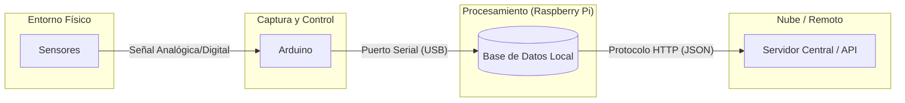
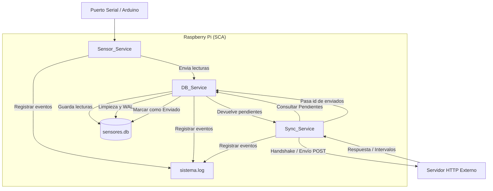

# Prototipo de dispositivo de captura de datos para monitoreo de calidad del agua

Este proyecto contiene el código fuente para el dispositivo de captura de datos de parámetros de calidad de agua para un sistema de monitoreo de la calidad del agua de ríos, enmarcado en el proyecto de investigación [**PINV01-267**](https://sca.facitec.edu.py/proyecto), financiado por el **CONACYT** de Paraguay a través de la **FACITEC - UNICAN**.

### Estructura del proyecto

```text
 ├── app.py                # Orquestador principal del sistema
 ├── app.service           # Archivo de configuración para el servicio systemd
 ├── conf_service.py       # Servicio de gestión de configuración local (JSON)
 ├── config.json           # Parámetros de configuración (URLs, IDs, intervalos)
 ├── db_service.py         # Gestión de base de datos SQLite, mantenimiento y limpieza
 ├── logs_service.py       # Configuración del sistema de logging rotativo
 ├── README.md             # Documentación técnica del proyecto
 ├── LICENSE.md            # Licencia del proyecto
 ├── requirements.txt      # Dependencias del proyecto
 ├── sensor_service.py     # Lógica de comunicación serial y captura de sensores
 └── sync_service.py       # Orquestador de sincronización y envío de datos
```

-----

## 2. Arquitectura del software

### Flujo general de datos

Este diagrama describe el trayecto de la información desde el entorno físico hasta el almacenamiento centralizado.



### Componentes de software

El sistema está diseñado bajo una arquitectura de **multihilo (Multithreading)**, permitiendo que cada servicio opere de forma independiente sin bloquear al resto del sistema.

El siguiente diagrama detalla la interacción interna de los hilos dentro de la Raspberry Pi y cómo gestionan los recursos.



  * **Sensor service:** Mantiene una comunicación serial persistente con el Arduino. Está diseñado para evitar reinicios constantes del microcontrolador, garantizando la estabilidad térmica de los sensores.
  * **Db service:** Gestiona la persistencia en una base de datos SQLite optimizada con el modo **WAL (Write-Ahead Logging)** para permitir lecturas y escrituras simultáneas. Incluye un hilo de mantenimiento para limpieza automática de datos antiguos.
  * **Sync service:** Realiza un *handshake* dinámico con el servidor para actualizar intervalos de captura y gestiona el envío de lotes pendientes cuando hay conectividad.

-----

## 3. Requisitos de hardware

El prototipo se integra mediante los siguientes componentes:

  * **Cerebro:** Raspberry Pi 4 Model B (o similar).
  * **Controlador de sensores:** Arduino Nano / Uno.
  * **Sensores integrados:**
      * Oxígeno disuelto (OD).
      * Potencial de hidrógeno (pH).
      * Conductividad eléctrica.
      * Turbidez.
      * Sólidos disueltos totales (TDS).
      * Temperatura del agua.
  * **Interfaz:** Conexión Serial vía USB con protocolo de reconexión automática.

-----

## 4. Requisitos de software y dependencias

| Software / Librería | Descripción |
| :--- | :--- |
| **Python 3.13.5+** | Lenguaje base de ejecución. |
| **peewee** | ORM ligero para gestión de SQLite. |
| **pyserial** | Comunicación con el hardware Arduino. |
| **requests** | Cliente HTTP para sincronización con la API central. |
| **venv** | Entorno virtual para aislamiento de dependencias. |

-----

## 5. Instalación y configuración

1.  **Clonar el repositorio:**
    ```bash
    git clone [url-del-repositorio]
    cd prototipo_raspberry
    ```
2.  **Configurar el entorno virtual:**
    ```bash
    python3 -m venv env
    source env/bin/activate
    pip install -r requirements.txt
    ```
3.  **Configuración (`config.json`):**
    Ajustar los parámetros según el servidor de destino:
      * `base_url`: Dirección de la API central.
      * `dispositivo_id`: Identificador único del nodo.
      * `intervalo_lectura_seg`: Tiempo entre capturas de sensores.

-----

## 6. Gestión de ejecución (Systemd)

Para garantizar que el SCA inicie automáticamente al encender la Raspberry Pi:

1.  **Instalar el servicio:**
    ```bash
    sudo cp app.service /etc/systemd/system/
    sudo systemctl daemon-reload
    sudo systemctl enable app.service
    sudo systemctl start app.service
    ```
2.  **Comandos útiles de monitoreo:**
    ```bash
    # Ver estado del servicio
    sudo systemctl status app.service
    # Ver logs en tiempo real
    journalctl -u app.service -f
    ```

-----

## 7. Estructura de datos (Base de datos)

El sistema utiliza **UUID** como clave primaria para garantizar la unicidad de los registros entre múltiples dispositivos durante la sincronización global.

### Diccionario de datos: Tabla `Lectura`

| Campo | Tipo | Descripción |
| :--- | :--- | :--- |
| `id` | UUID | Identificador único universal (Primary Key). |
| `timestamp` | DateTime | Fecha y hora local de la captura. |
| `od` | Float | Oxígeno disuelto (mg/L). |
| `ph` | Float | Potencial de hidrógeno. |
| `con` | Float | Conductividad eléctrica (µS/cm). |
| `tur` | Float | Turbidez (NTU). |
| `tsd` | Float | Sólidos disueltos totales (ppm). |
| `tem` | Float | Temperatura del agua (°C). |
| `is_send` | Boolean | Estado de sincronización (True: Enviado / False: Pendiente). |

-----

## 8\. Manejo de errores y resiliencia

El SCA implementa un diseño **Self-healing** (auto-recuperable):

  * **Falta de internet:** Si el servidor no está disponible, las lecturas se acumulan localmente y se envían automáticamente en lotes una vez se restablece la conexión.
  * **Desconexión de hardware:** El servicio de sensores detecta la pérdida de comunicación con el Arduino e intenta reconectar de forma automática sin detener la aplicación.

-----

## 9\. Autores y contacto

  * **Investigador principal:** Daniel Romero
  * **Director del proyecto:** Rodrigo Martínez
  * **Equipo de desarrollo:** David Ruiz Diaz, Nazario Ayala, Angel Heimann, Gloria Ortiz.
  * **Contacto:** [dir.invext@facitec.edu.py](mailto:dir.invext@facitec.edu.py)
  * **Institución:** Facultad de Ciencias y Tecnología (FACITEC) - Universidad Nacional de Canindeyú (UNICAN).

-----

## Licencia

Este proyecto está licenciado bajo los términos de la **Licencia Pública General de GNU v3.0**. Consulta el archivo [LICENSE.md](./LICENSE.md) para más detalles.

